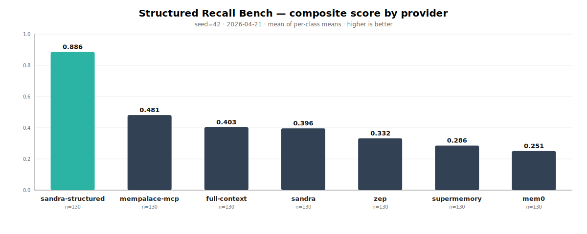

# Structured Recall Bench (SRB)



**→ [Interactive dashboard](https://raw.githack.com/everdreamsoft/structured-recall-bench/main/results/dashboard.html)** (per-class breakdown, recon diagnostics, latency, provider toggles).

> **Disclosure up front.** SRB is authored by [EverdreamSoft](https://github.com/everdreamsoft), the team behind [Sandra](https://github.com/everdreamsoft/sandra). Sandra is one of the providers benchmarked here, and `sandra-structured` currently tops the leaderboard. We designed this benchmark around a capability gap we believe the top-K memory category has; if that framing is wrong, the archived JSON in `results/` — deterministic seed, no LLM-judge scorer, raw responses for every question — will say so first. See [Disclosure & reproducibility](#disclosure) for the full note.

> Leading agent-memory systems score **0.00–0.05** on mixed-conditional queries like *"who is our top-spending customer in France in 2025?"*. Even full-context with `gpt-4.1-mini` (haystack pasted into the prompt) scores **0.20**. A structured graph with a query planner scores **1.00**. This repository measures that gap with 130 deterministic questions, a no-LLM-judge scorer, and archived JSON for every run.

## One concrete example

From the 130 questions, here is `ecsv-country-switzerland-churned` (class `enumeration_csv`):

**Question** *(same prompt sent to every provider)*
> List the names of all churned customers from Switzerland.

**Ground truth** *(deterministic, derived from the dataset)*
```
["Fredy Cormier"]
```

**What each provider actually answered** *(raw strings from `results/*.json`)*

| Provider            | Response                                                                              | F1   |
| ------------------- | ------------------------------------------------------------------------------------- | ---- |
| `sandra-structured` | `Fredy Cormier`                                                                       | 1.00 |
| `full-context`      | `Marcel D'Amore, Josianne Collier-Padberg, Fredy Cormier, Jake Powlowski, Joshuah Herzog` | 0.33 |
| `zep`               | `Cecile White, Joshuah Herzog, Linnea McGlynn, Shanel Feeney, Cheyenne Treutel`       | 0.00 |
| `mem0`              | `None`                                                                                | 0.00 |

Two things this shows that the category's usual benchmarks do not:

1. **Top-K retrievers return plausible-looking but wrong sets.** `zep` confidently lists five Swiss-sounding names — none of them the churned one. Similarity retrieval can't tell "looks Swiss" from "is tagged country=Switzerland AND status=churned."
2. **Full-context with a modern LLM still hallucinates.** The entire corpus is in the prompt; `gpt-4.1-mini` nonetheless emits four false positives. Long-context ≠ exhaustive recall.

## Thesis

Benchmarks like LongMemEval, LoCoMo, and ConvoMem measure *"can the system retrieve one relevant fact from a conversational haystack"* — top-K similarity retrieval, the operation `mem0` / `zep` / `supermemory` / `mempalace` / `letta` are optimized for. They cluster at 70–85% on those benchmarks because they all solve the same problem the same way.

SRB measures what those benchmarks do not: **enumerate every entity matching a structured criterion, aggregate across them, reconcile contradictory versions**. A top-K index is architecturally incapable of returning "all N that match" — it returns the K most similar to the query.

## Is this fair to top-K retrievers?

The most legitimate objection to SRB is: *"top-K retrievers aren't designed for exhaustive enumeration — you're benchmarking them on a task they weren't built for."* That's true, and it deserves a direct answer.

- **The category has moved.** `mem0`, `zep`, `supermemory`, `letta`, `mempalace` no longer market themselves as "chat-preferences memory." Their landing pages advertise ingesting CSVs, transcripts, documents, knowledge bases. If a system accepts that ingestion surface, it implicitly accepts the query surface — *"list all customers in France"* is a question a user of the marketed product will ask.
- **"Use a real database alongside" breaks the pitch.** The value proposition of modern agent memory is a single substrate. If the answer to structured recall is "bolt Postgres next to it," the unified-memory claim is false. SRB makes that trade-off measurable rather than rhetorical.
- **The benchmark is not rigged to make top-K fail everywhere.** `reconciliation_update` is a task similarity retrieval can do well, and several top-K systems score 0.65–0.90 on it. The gap appears where the architecture is genuinely blind (enumeration, aggregation, mixed conditionals), not as an artifact of the scoring.
- **Heterogeneous agents need heterogeneous-safe memory.** A real agent receives *"what did Alice say about pricing last call?"* AND *"how many active French customers do we have?"* in the same session. A memory layer that silently fails on one half of that traffic is a landmine — the agent has no way to know which queries are safe.
- **SRB is a positioning benchmark, not a replacement for LongMemEval.** Run both. LongMemEval measures "retrieve one relevant fact." SRB measures "retrieve all matching facts and reason across them." A production choice needs both signals.

## Results (seed 42, 130 questions, `gpt-4.1-mini`)

| Provider            | Composite | Enum CSV | Enum Chat | Agg  | Reconcile | Mixed | Multi-Enum | Multi-Agg | Bootstrap |
| ------------------- | --------: | -------: | --------: | ---: | --------: | ----: | ---------: | --------: | --------: |
| `sandra-structured` |      0.89 |     1.00 |      1.00 | 1.00 |      1.00 |  1.00 |       1.00 |      1.00 |      0.09 |
| `mempalace-mcp`     |      0.48 |     0.51 |      0.58 | 0.37 |      0.90 |  0.30 |       0.37 |      0.48 |      0.34 |
| `full-context`      |      0.40 |     0.46 |      0.49 | 0.20 |      0.90 |  0.20 |       0.40 |      0.29 |      0.29 |
| `sandra`            |      0.40 |     0.46 |      0.65 | 0.15 |      1.00 |  0.05 |       0.40 |      0.26 |      0.19 |
| `zep`               |      0.33 |     0.49 |      0.77 | 0.22 |      0.45 |  0.05 |       0.51 |      0.10 |      0.07 |
| `supermemory`       |      0.29 |     0.05 |      0.73 | 0.21 |      0.85 |  0.00 |       0.40 |      0.00 |      0.04 |
| `mem0`              |      0.25 |     0.04 |      0.49 | 0.18 |      0.65 |  0.00 |       0.50 |      0.00 |      0.15 |

What the numbers say:

- **`sandra-structured` (Sandra + a query planner emitting typed graph traversals) reaches 1.00 on all seven structured classes.** The only class it drops is `bootstrap_multihop` (chain enumerate-then-aggregate).
- **`full-context` is only 0.40 — not a positive control.** Even with the full ~60k-token haystack in-prompt, `gpt-4.1-mini` fails exhaustive enumeration (0.46 on `enumeration_csv`). That *no* provider clears 50% without a query planner is the core finding, not a bug.
- **Top-K retrievers collapse on `mixed_conditional` (0.00–0.05) and `enumeration_csv` (0.04–0.05).** These are the queries most real agent workloads need.
- **`bootstrap_multihop` is hard for everyone (≤0.34).** Chaining retrieval over retrieval is the open frontier.
- **Reconciliation does not need a graph.** Several top-K systems score 0.65–0.90 — "return the latest value mentioned" is a task similarity retrieval can stumble into.

## One question per class

Actual prompts from `datasets/customer-records-v1/questions.json` (ground-truth values shown for the first instance of each class):

| Class                      | Example question                                                                                                                  | Truth                                                |
| -------------------------- | --------------------------------------------------------------------------------------------------------------------------------- | ---------------------------------------------------- |
| `enumeration_csv`          | List the names of all churned customers from Switzerland.                                                                         | `["Fredy Cormier"]`                                  |
| `enumeration_chat`         | Which customers bought paper from us in 2025, based on purchase activity we discussed in chat?                                    | 40+ names                                            |
| `aggregation_cross_source` | What is the total amount (USD) of all 2025 purchases from customers based in Switzerland?                                         | `10391200`                                           |
| `reconciliation_update`    | What is Priscilla Collins's *current* annual revenue (USD)? Use the most recent information available.                            | `19113000` (post-update; v1 value scored `stale-v1`) |
| `mixed_conditional`        | Who is our top-spending customer based in France for 2025, combining all their purchase activity?                                 | `"Ben Nolan"`                                        |
| `multi_condition_enum`     | List active customers based in France in the Fintech industry with more than 500 employees.                                      | `["Nikolas Buckridge","Orie Kuhlman"]`               |
| `multi_condition_agg`      | What is the total purchase amount from active French customers in the Fintech industry?                                           | `234000`                                             |
| `bootstrap_multihop`       | List the names of every customer based in the same country as Priscilla Collins (excluding Priscilla herself).                    | 25+ names                                            |

## Scoring (no LLM-judge)

The scorer is pure TypeScript — `src/scorer.ts` — and deterministic. Enumerations use token-level F1 against canonical names:

```ts
const tp = matchedCorrect.length   // names in both response and ground truth
const fp = falsePositives.length   // names in response but not in ground truth
const fn = missed.length           // names in ground truth but not in response

const precision = tp / (tp + fp)
const recall    = tp / (tp + fn)
const f1        = (2 * precision * recall) / (precision + recall)
```

| Class                      | Scorer                                                              |
| -------------------------- | ------------------------------------------------------------------- |
| `enumeration_csv` / `_chat` | F1 on names (accent- and case-insensitive fuzzy match)             |
| `multi_condition_enum`     | F1 on names with all predicates applied                             |
| `aggregation_cross_source` / `multi_condition_agg` | `max(0, 1 - abs(v_resp - v_truth) / v_truth)` |
| `reconciliation_update`    | Exact match post-update; response = v1 value scored 0 as `stale-v1` |
| `mixed_conditional`        | Name fuzzy match + first-mention heuristic                          |
| `bootstrap_multihop`       | Composite of sub-step scores                                        |

Composite = mean of per-class means. The reconciliation breakdown (`correct` / `stale-v1` / `wrong` / `no-answer`) is a diagnostic: high `stale-v1` means the provider retrieved the original fact instead of the latest.

## Try it in under a minute

Requires **bun ≥ 1.3** and `OPENAI_API_KEY` (used for answer generation across all providers).

```bash
git clone https://github.com/everdreamsoft/structured-recall-bench
cd structured-recall-bench && bun install

# 1. Generate the dataset (byte-deterministic, seed=42)
bun run generate

# 2. Dry-run (no LLM calls, no API key needed) — prints questions + wiring
bun run src/runner.ts --provider full-context --dry-run --questions 3

# 3. Real run, full-context baseline
export OPENAI_API_KEY=sk-...
bun run src/runner.ts --provider full-context --questions 5
```

The last command prints per-question scores as they come back and writes `results/YYYY-MM-DD_full-context_seed42.json`. Drop `--questions 5` for a full 130-question run. Hard-suite runs land alongside as `*_seed42_hard.json`.

## Dataset

`datasets/customer-records-v1/` (all files checked in, `bun run generate` is byte-reproducible):

- **500 customers** — `@faker-js/faker` seed=42, across 20 countries × 10 industries, with `annual_revenue_usd`, `employees`, `signup_date`, `status`
- **200 purchase events** — product, amount, date in 2025, referencing customers by name
- **50 updates** — field corrections, new late-cycle customers, churn events, applied in temporal order
- **~20 synthesized sessions** covering four interaction patterns:
  - **A)** CSV v1 bulk uploads (~8 sessions)
  - **B)** Conversational chat updates with purchases (~6 sessions)
  - **C)** CSV v2 differentials (~3 sessions)
  - **D)** Narrative multi-entity recaps (~3 sessions)
- **130 questions** — 5 core classes × 20 + 3 hard classes × 10

CI can verify reproducibility with `git diff --exit-code datasets/` after `bun run generate`.

## Supported providers

**Built-in** (no external dependency — cloning SRB is enough):

| Provider            | Source                                                 |
| ------------------- | ------------------------------------------------------ |
| `full-context`      | `src/providers/full-context.ts`                        |
| `sandra-structured` | `src/providers/sandra-structured.ts` (graph + planner) |
| `mempalace-mcp`     | `src/providers/mempalace-mcp.ts`                       |
| `mem0-planned`      | `src/providers/mem0-planned.ts`                        |

**Via memorybench** (requires cloning `github.com/supermemoryai/memorybench` as a sibling directory — each provider reads its own API key from `.env`):

- `mem0`, `zep`, `supermemory`, `filesystem`, `rag`

Reproducing *only* the built-in providers does not require memorybench. The archived JSON in `results/` lets you inspect the full leaderboard without running the top-K providers yourself.

## Methodology

- **Default answer LLM**: `gpt-4.1-mini`. Override with `SRB_ANSWER_MODEL`.
- **Answer prompt**: "Answer using ONLY the provided context. Prefer the most recent value if there are updates." Deliberately narrow — no chain-of-thought, no tool use — to match how most agent-memory products are wired in production.
- **Same answer LLM, same temperature across all providers.** Score differences are attributable to retrieval, not to answer generation.
- **Token budget**: the haystack is ~50–70k tokens, well inside `gpt-4.1-mini`'s 128k window.

## License

MIT — see `LICENSE`.

## Disclosure

This benchmark is authored by **EverdreamSoft**, the team behind [Sandra](https://github.com/everdreamsoft/sandra) — one of the providers benchmarked here. The `sandra-structured` provider uses Sandra with a query planner and currently tops the leaderboard. That outcome is the reason we built SRB. It is also the reason we took the steps below *before* running any competitor; a benchmark authored by an interested party is worth exactly as much as it is checkable.

We made the benchmark verifiable by construction:

- Fixed seed, byte-reproducible dataset (`bun run generate`)
- Deterministic scorer (no LLM-judge) — `src/scorer.ts`
- Every run archived as raw JSON in `results/` — including responses, timings, and per-question scores

If a provider documents a feature that would change its score and we didn't use it, open an issue or PR and we'll add support and re-run. If you find a question whose ground truth is ambiguous, the same. The numbers in `results/` are the single source of truth.
